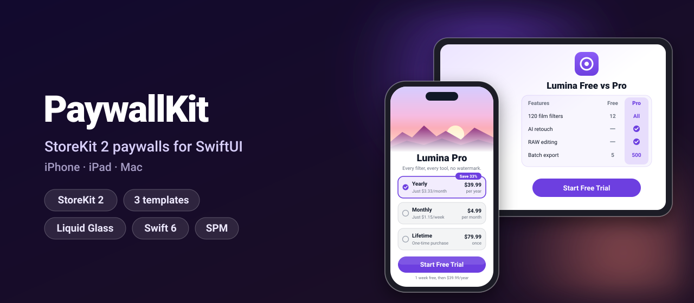
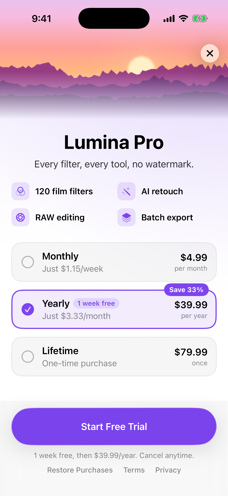
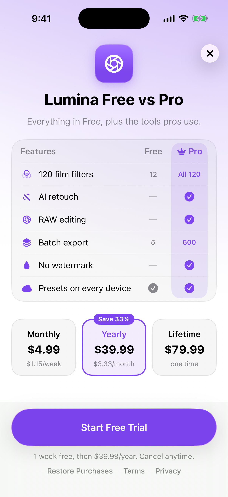
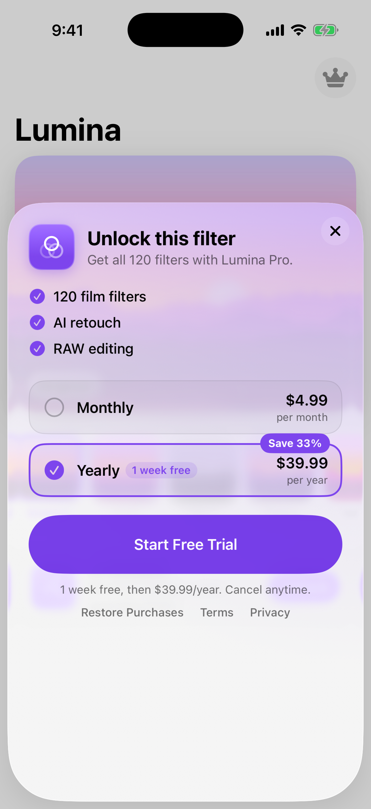
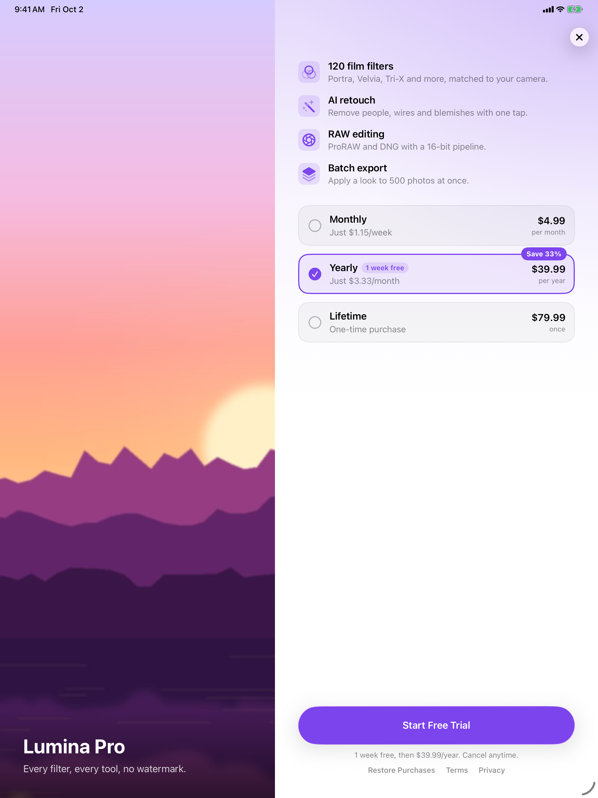

<p align="center">
  
</p>

<p align="center">
  <a href="https://github.com/halilozel1903/PaywallKit/actions/workflows/ci.yml"></a>
  
  
  
  
  
  <a href="LICENSE"></a>
</p>

**PaywallKit** gives your SwiftUI app a finished paywall in a few lines: **plans, free trials, restore and entitlement state** on top of StoreKit 2, with **three polished templates** for iPhone, iPad and Mac. The price texts ("$3.33/month", "Save 33%", "1 week free, then $39.99/year") come from tested `Decimal` math, and a preview store with fake products makes previews, screenshots and tests work without the App Store.

```swift
@State private var paywall = PaywallController(productIDs: ["pro.monthly", "pro.yearly", "pro.lifetime"])

ContentView()
    .paywall(isPresented: $showsPaywall, controller: paywall, content: content)
```

## Screenshots

Captured from the example app on iOS 26 simulators by CI.

| Hero | Comparison | Minimal |
| :---: | :---: | :---: |
|  |  |  |

On iPad (and on the Mac) the hero paywall uses two columns:

<p align="center">
  
</p>

## Features

- **StoreKit 2 inside**: `StoreKitPaywallStore` loads products with `Product.products(for:)`, buys with `purchase()`, only accepts verified transactions and finishes them, reads `Transaction.currentEntitlements`, listens to `Transaction.updates` (renewals, refunds, Ask to Buy) and restores with `AppStore.sync()`.
- **One controller**: `PaywallController` is `@Observable` and holds the products, the purchase in progress and an `EntitlementState` (`unknown`, `inactive` or `active`) that every view can read.
- **Three templates**:
  - `HeroPaywall`: a large image, the features and a card per plan; two columns on iPad and Mac.
  - `ComparisonPaywall`: a free vs Pro table above side-by-side plan tiles.
  - `MinimalPaywall`: a compact sheet with three features and a row per plan.
- **Plan texts done right**: price per week or month, "Save 33%" against the monthly plan (rounded down, never over-promised), free trials, pay-as-you-go and pay-up-front offers, all with `Decimal` and an injected locale.
- **Trial eligibility**: the offer is only shown, and the button only says "Start Free Trial", while the user can still redeem it.
- **One-line presentation**: `.paywall(isPresented:controller:content:template:)` covers the screen on iPhone and iPad (the minimal template is a sheet) and is a sheet on the Mac. A successful purchase or restore closes it.
- **`EntitlementGate`**: shows your Pro content with access, a lock with an Unlock button (or your own view) without, and switches the moment the entitlement changes.
- **Preview store**: `PreviewPaywallStore` sells $4.99/month, $39.99/year with a one-week trial and $79.99 lifetime. Purchases succeed, cancel, stay pending or fail on demand, and its clock can be moved to end a trial.
- **Liquid Glass**: `.glassProminent` buttons and a glass close button on iOS 26 and macOS 26; bordered buttons and materials on iOS 17 and macOS 14.
- **StoreKit configuration file**: the example app ships `Lumina.storekit`, so purchases work in the simulator without App Store Connect.
- **Swift 6 strict concurrency**, zero dependencies, tested with Swift Testing.

## Installation

In Xcode choose **File › Add Package Dependencies…** and enter:

```
https://github.com/halilozel1903/PaywallKit
```

Or add it to `Package.swift`:

```swift
dependencies: [
    .package(url: "https://github.com/halilozel1903/PaywallKit", from: "1.0.0")
]
```

## Quick start

```swift
import PaywallKit
import SwiftUI

@main
struct LuminaApp: App {
    @State private var paywall = PaywallController(
        productIDs: ["lumina.pro.monthly", "lumina.pro.yearly", "lumina.pro.lifetime"]
    )

    var body: some Scene {
        WindowGroup {
            EditorView(paywall: paywall)
                .task { await paywall.start() }   // products, entitlements, transaction updates
        }
    }
}

struct EditorView: View {
    let paywall: PaywallController
    @State private var showsPaywall = false

    let content = PaywallContent(
        title: "Lumina Pro",
        subtitle: "Every filter, every tool, no watermark.",
        header: .image("PaywallHero"),                       // from your asset catalog
        features: [
            PaywallFeature(systemImage: "camera.filters", title: "120 film filters"),
            PaywallFeature(systemImage: "wand.and.stars", title: "AI retouch"),
            PaywallFeature(systemImage: "camera.aperture", title: "RAW editing"),
            PaywallFeature(systemImage: "drop.fill", title: "No watermark"),
        ],
        highlightedProductID: "lumina.pro.yearly",           // selected first, marked "Save 33%"
        tint: .purple,
        termsOfServiceURL: URL(string: "https://example.com/terms"),
        privacyPolicyURL: URL(string: "https://example.com/privacy")
    )

    var body: some View {
        PhotoEditor()
            .toolbar {
                if !paywall.isEntitled {
                    Button("Go Pro", systemImage: "crown.fill") { showsPaywall = true }
                }
            }
            .paywall(isPresented: $showsPaywall, controller: paywall, content: content)
    }
}
```

## Usage

### Templates

```swift
HeroPaywall(controller: paywall, content: content)
ComparisonPaywall(controller: paywall, content: content)
MinimalPaywall(controller: paywall, content: content)

PaywallView(controller: paywall, content: content, template: .comparison)
.paywall(isPresented: $showsPaywall, controller: paywall, content: content, template: .minimal)
```

The same `PaywallContent` works with every template. For the comparison table, say what the free version gets:

```swift
PaywallFeature(systemImage: "camera.filters", title: "Film filters", free: .limited("12"), pro: .limited("All 120"))
PaywallFeature(systemImage: "wand.and.stars", title: "AI retouch")              // free: .excluded, pro: .included
PaywallFeature(systemImage: "icloud.fill", title: "iCloud sync", free: .included)
```

| `PaywallContent` | Meaning |
| --- | --- |
| `title`, `subtitle` | The headline. `LocalizedStringResource`, so literals are looked up in your string catalog. |
| `header` | `.image("Asset")` drawn edge to edge, `.symbol("sparkles")` on the tint, or `.none`. |
| `iconSystemImage` | The icon tile of the comparison and minimal templates. |
| `features` | Rows of the feature list and the comparison table. The minimal template shows the first three. |
| `highlightedProductID` | Selected at first and marked "Save x%" (or "Best value"). |
| `hiddenProductIDs` | Products to leave off, for example the lifetime unlock on the minimal sheet. |
| `tint` | Buttons, selection, icons and the background glow. |
| `callToAction` | Replaces "Start Free Trial", "Subscribe" or "Unlock Forever". |
| `termsOfServiceURL`, `privacyPolicyURL` | Links under the purchase button, required by App Review for subscriptions. |

### Gate Pro content

```swift
EntitlementGate(controller: paywall) {
    RetouchTools()
} locked: {
    Button("Unlock AI Retouch") { showsPaywall = true }
}

// Or with a built-in lock that presents the paywall:
EntitlementGate(controller: paywall, content: content, title: "AI Retouch") {
    RetouchTools()
}
```

Or read the state yourself:

```swift
switch paywall.entitlement {
case .unknown: ProgressView()
case .inactive: UpgradeBanner()
case .active(let entitlement):
    if entitlement.isInTrialPeriod { Text("Trial ends \(entitlement.expirationDate!, style: .date)") }
}
```

### Buy and restore from your own UI

```swift
let product = paywall.product(withID: "lumina.pro.yearly")!
switch try await paywall.purchase(product) {
case .purchased(let entitlement): print("Unlocked", entitlement.productID)
case .pending: print("Waiting for Ask to Buy")
case .cancelled: break
}

let hasPro = try await paywall.restore()
```

### Plan texts

`PlanFormatter` turns products into the texts the templates show. Use it for paywalls of your own:

```swift
let formatter = PlanFormatter(locale: Locale(identifier: "en_US"))

formatter.recurringPrice(of: yearly)                 // "$39.99/year"
formatter.pricePerUnit(of: yearly, unit: .month)     // "$3.33/month"
formatter.pricePerUnit(of: monthly, unit: .week)     // "$1.15/week"
formatter.savingsText(for: yearly, in: products)     // "Save 33%"
formatter.introOfferText(for: yearly)                // "1 week free, then $39.99/year"
formatter.billingText(for: yearly)                   // "1 week free, then $39.99/year. Cancel anytime."
formatter.callToAction(for: yearly)                  // "Start Free Trial"
```

| Offer | Text |
| --- | --- |
| Free trial, 1 week | 1 week free, then $39.99/year |
| Free trial, 3 days | 3 days free, then $9.99/month |
| Pay as you go, $0.99 × 3 months | $0.99/month for 3 months, then $4.99/month |
| Pay up front, $9.99 for 6 months | $9.99 for 6 months, then $39.99/year |

The arithmetic lives in `PlanMath` and never touches `Double`: a year is 12 months, 52 weeks or 365 days, per-unit prices round to cents, and savings round down. Amounts follow the locale (`39,99 €` in Germany); the templates use the storefront's locale from StoreKit. The words are English; replace the call to action with `PaywallContent.callToAction`.

### Previews, screenshots and tests

```swift
#Preview {
    HeroPaywall(controller: .preview(), content: content)         // products loaded, no App Store
}
```

```swift
@MainActor
@Test func trialUnlocksPro() async throws {
    let store = PreviewPaywallStore()                               // pro.monthly, pro.yearly, pro.lifetime
    let paywall = PaywallController(productIDs: store.productIDs, store: store)
    await paywall.start()

    try await paywall.purchase(paywall.product(withID: "pro.yearly")!)
    #expect(paywall.entitlement.entitlement?.isInTrialPeriod == true)

    store.advance(by: 8 * 86_400)                                   // past the one-week trial
    await paywall.refreshEntitlements()
    #expect(paywall.entitlement == .inactive)
}
```

`PreviewPaywallStore` options: `purchaseBehavior` (`.succeed`, `.cancel`, `.pending`, `.fail(error)`), `restorableEntitlements`, `latency`, and `advance(by:)`, `expire(_:)`, `refund(productID:)` and `grant(_:)` to simulate what happens outside the app.

### Your own backend

Conform to `PaywallStore` to sell through a server or another SDK. The templates, the gate and the controller stay the same:

```swift
@MainActor
final class MyStore: PaywallStore {
    func products(for ids: [String]) async throws -> [PaywallProduct] { … }
    func purchase(_ product: PaywallProduct) async throws -> PurchaseOutcome { … }
    func restorePurchases() async throws { … }
    func currentEntitlements() async -> [Entitlement] { … }
    func entitlementUpdates() -> AsyncStream<Void> { … }
}
```

## How it works

| | iPhone | iPad | Mac |
| --- | --- | --- | --- |
| Hero | Full screen, one column | Full screen, two columns | Sheet, two columns |
| Comparison | Full screen | Full screen, centered | Sheet |
| Minimal | Sheet (640 pt, expandable) | Sheet | Sheet |

| | iOS 26 / macOS 26 | iOS 17 / macOS 14 |
| --- | --- | --- |
| Purchase button | `.glassProminent` | `.borderedProminent` |
| Close button | `glassEffect` circle | `.ultraThinMaterial` circle |

`PaywallController.start()` loads the products, asks the store for the current entitlements and starts one listener on `Transaction.updates`. The entitlement is the best active one among your product IDs: a lifetime unlock first, otherwise the subscription that runs longest. Refunded and upgraded transactions never count.

## Example app

The `Example` folder contains *Lumina*, a made-up photo editor for iPhone and iPad. Pro looks open the minimal paywall, the locked AI Retouch tool opens the comparison paywall, and the toolbar menu shows any template. Run from Xcode it buys the products in `Lumina.storekit`; launch with `-previewStore` to use the in-memory store instead. It uses [XcodeGen](https://github.com/yonaskolb/XcodeGen) so no project file has to live in the repo:

```bash
brew install xcodegen
cd Example && xcodegen generate
open PaywallKitDemo.xcodeproj
```

To test purchases, keep the scheme's StoreKit configuration set to `Lumina.storekit` (XcodeGen sets it) and use **Debug › StoreKit › Manage Transactions** to refund, expire or approve them.

## Requirements

- Xcode 26 or later (Swift 6.2 toolchain)
- iOS 17+, iPadOS 17+, macOS 14+ (Liquid Glass automatically on 26+)

## Contributing

Issues and pull requests are welcome. Please run `swift test` before opening a PR.

## License

PaywallKit is available under the MIT license. See [LICENSE](LICENSE).
